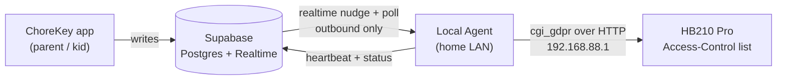

# ChoreLock Local Agent — router enforcement for non-Apple devices

Enforcement path for `platform='other'` devices (Android / Windows / consoles) that
iOS Screen Time can't touch. A small always-on process on the **home LAN** blocks/unblocks
those devices' Wi-Fi by driving the household router's access-control list.

> iOS devices stay on Screen Time (`src/native/screenTime.ts`). This agent is **only** for
> `devices.platform = 'other'`, whose `identifier` column already holds the MAC.

## Why a local agent (not router remote management)

The router (TP-Link HB210 Pro, Aginet firmware) *can* expose its admin API to the WAN, but
that puts the admin login on the public internet on firmware we can't patch on our own schedule.
Instead the agent lives on the LAN and makes only **outbound** connections to Supabase — no
inbound ports, no port-forwarding, no router WAN exposure, no dynamic-DNS. The router never
leaves the LAN.

## Architecture



Data flow for one lock change:
1. A chore is approved (or a parent toggles override). Existing triggers recompute `kid_lock_state`.
2. Supabase Realtime nudges the agent (backstop: the agent polls every 30 s regardless).
3. The agent computes the **desired blocked-MAC set** and reconciles the router's blacklist to match.
4. The agent writes back status (per-MAC enforced/failed) and a heartbeat.

The transport only *triggers* work; correctness comes from **reconciliation**, not from any single
message being delivered. That is what makes it survive the router's flaky session, agent restarts,
and router reboots.

## Desired state

For each kid: if `kid_lock_state.state = 'locked'`, **all** their `platform='other'` devices should be
blocked; if `'unlocked'`, none should be. So the desired blacklist for a family is:

```sql
-- Proposed view (migration 0004). MACs that must be blocked right now.
create view router_desired_locks as
select d.family_id, d.mac
from (
  select k.family_id, dev.identifier as mac
  from kids k
  join kid_lock_state s on s.kid_id = k.id
  join devices dev on dev.kid_id = k.id
  where s.state = 'locked' and dev.platform = 'other'
) d;
```

Reconciliation is a set diff against the router's live blacklist — **idempotent**:

```
desired  = supabase.router_desired_locks(family)      // MACs that should be blocked
current  = router.listBlacklist()                     // MACs on the router now
toBlock   = desired − current
toUnblock = current − desired                          // only ChoreLock-owned rules (see below)
for mac in toBlock:   router.block(mac)
for mac in toUnblock: router.unblock(mac)
router.setAclMaster(desired.nonEmpty)                  // ACL on iff we own ≥1 rule
```

**Ownership:** the agent only ever adds/removes rules named `ChoreLock:<mac>` and must never touch
rules a human added by hand (e.g. the existing `kitchen` whitelist entry). `toUnblock` is filtered to
ChoreLock-owned rule names only.

## Supabase additions (migration 0004 + `agent-api` edge function)

Mirror the existing `devices` / `kid-api` pattern — the agent is a trusted household appliance that
talks through an edge function with a shared secret, so no broad DB grants and no new RLS surface.

```sql
create table agents (
  id uuid primary key default gen_random_uuid(),
  family_id uuid not null references families(id) on delete cascade,
  name text not null,
  agent_secret text not null,          -- bearer the agent presents; store a hash in prod
  last_seen timestamptz,
  last_status jsonb,                   -- per-MAC {mac: 'enforced'|'failed'|'off', at}
  created_at timestamptz not null default now()
);
alter table agents enable row level security;
create policy parent_agents on agents for all using (family_id = my_family_id());
```

`supabase/functions/agent-api/` (service role, validates `agent_secret`):
- `GET  /desired`  → `{ macs: string[] }` from `router_desired_locks` for the agent's family.
- `POST /status`   → upserts `agents.last_seen`, `last_status` (drives an "enforcement offline" banner in the app).

The agent authenticates with `agent_secret` only; it never holds a Supabase service key.

## Router client (`agent/src/router/hb210.ts`)

Speaks the HB210 Pro's encrypted admin API. Protocol was reverse-engineered from the live unit —
see `~/.claude` memory `chorelock-router-integration` for the full capture. Summary:

- **Endpoint:** single `POST /cgi_gdpr`, body = AES-CBC(payload) + RSA-signed, base64. The login
  handshake and AES/RSA are the stock TP-Link scheme (ref: `tplinkrouterc6u`). Every request must
  carry `Referer: http://192.168.88.1/` or the server returns **406** (`httpRefererCheckEnabled=1`).
- **Data model** (`$.dm` verbs → data-model ops): `get / getList / getSubList / set / add / del`.

Block / unblock primitives (proven to add/enable/delete on the live unit):

```ts
interface RouterClient {
  login(): Promise<void>;                 // click-login equiv; re-login on session drop
  listBlacklist(): Promise<Rule[]>;       // getSubList DEV2_FW_CHAIN_RULE pstack=<black>
  block(mac: string): Promise<void>;      // add rule + set enable=1 + ACL master on
  unblock(mac: string): Promise<void>;    // del rule by stack
  setAclMaster(on: boolean): Promise<void>;
}
```

- Black chain: `getList('DEV2_FW_CHAIN')` → instance where `name === 'ACCESSCTL_BLACK'` (stack `2,0,0,0,0,0`).
- Block: `add('DEV2_FW_CHAIN_RULE', {X_TP_RuleName:'ChoreLock:'+mac, X_TP_SourceType:2, X_TP_SourceMACAddress:mac, pstack:<black>, target:'Drop'})`
  → returns the rule's `stack`; then `set('DEV2_FW_CHAIN_RULE', {stack, enable:1})`.
  **`enable`/`X_TP_SetAlready` passed *inside* `add` are silently dropped — always add first, then `set`.**
- ACL master: `set('DEV2_FIREWALL', {X_TP_EnableACL: on?1:0, X_TP_ACLMode:1})`.
- Unblock: `del('DEV2_FW_CHAIN_RULE', {stack})`.

### Session handling (the biggest reliability risk)

The web admin is **single-session with a tight idle timeout** — it dropped to the login page within
~1–2 minutes during testing, and a drop mid-write once left a half-applied rule. The client must:
- treat any "redirected to login" response as a session drop and transparently re-login + retry once;
- keep each reconcile to one short burst of calls;
- **verify after every write** (`getSubList` read-back) and re-apply on mismatch;
- log in by invoking the login button handler, not the Enter key (Enter does not submit).

## Open question — resolve before shipping: does the ACL actually enforce?

In testing, a blacklist rule with `enable=1` **and** the ACL master on still reported effective
`status: "Disabled"`, and we could not confirm the device lost internet (the ping test was invalid —
same-subnet traffic is switched and never hits the routing firewall). **First build step is a decisive
test:** add a rule for a known device and have *that device* fetch a WAN URL. Two outcomes:
- **Enforces** → this design is complete; wire it up.
- **Doesn't** → the real lever on this AP/mesh hardware is likely the **wireless MAC filter / client
  deauth** path, not the routing firewall. Swap the `block/unblock` internals to that OID surface;
  the rest of the architecture (agent, reconciliation, Supabase) is unchanged.

The agent ships with a **self-test** (`agent selftest <mac>`) that blocks, asks the device to curl,
and reports enforced/not — run once per firmware version, since Aginet updates can move OIDs.

## Failure modes & health

| Failure | Behavior |
|---|---|
| Agent process down | No enforcement. `last_seen` goes stale → app shows "Wi-Fi enforcement offline". Fail-safe: kids stay *unblocked* (chores still gate iOS). |
| Router session drops | Transparent re-login + retry; reconcile is idempotent. |
| Router reboots / rule lost | Next 30 s poll re-applies desired state. |
| Supabase unreachable | Agent keeps the **last known** desired set applied; retries; never flips to a guessed state. |
| Partial write | Read-back verify catches it; re-applied next tick. |

Fail **open** (unblocked), never closed — a bug must not trap a family off their own Wi-Fi.

## Deployment

Node service (matches the repo's TS stack), runs on any always-on LAN box — this machine, or a Pi.
Config via env, secrets never in the app or cloud:

```
CHORELOCK_SUPABASE_URL=...
CHORELOCK_AGENT_SECRET=...            # from the agents table
ROUTER_HOST=192.168.88.1
ROUTER_PASSWORD=...                   # router admin password, local to this host only
POLL_INTERVAL_SECONDS=30
```

Package: `agent/` (own `package.json`), run under a supervisor (Windows service / systemd / pm2)
with auto-restart. No inbound firewall rules required.

## Build sequence

1. **Enforcement test** — settle the open question above. Nothing else matters until Wi-Fi actually cuts.
2. `agent/src/router/hb210.ts` — the router client + `agent selftest`.
3. Migration 0004 — `agents` table + `router_desired_locks` view.
4. `supabase/functions/agent-api` — `/desired` + `/status`.
5. `agent/src/main.ts` — reconcile loop (poll + Realtime nudge), heartbeat, supervised restart.
6. App: parent Settings shows agent health + a per-`other`-device "enrolled for Wi-Fi lock" state.
